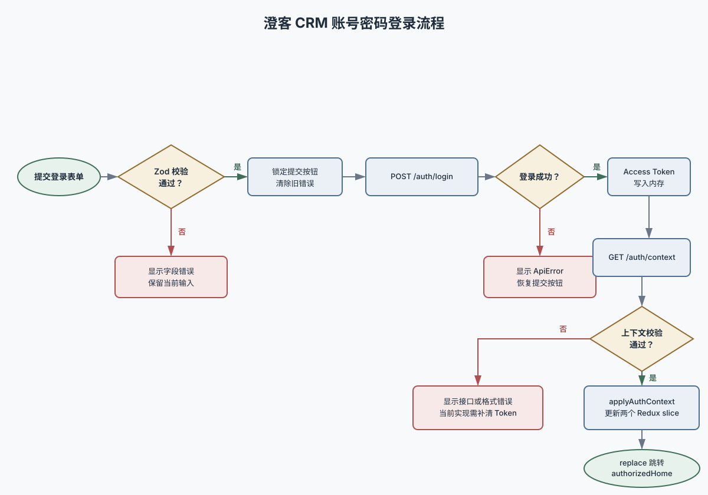
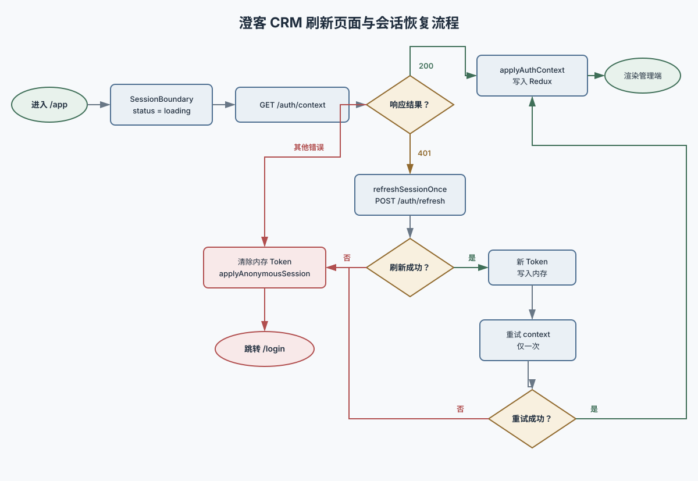

# 登录与认证模块维护手册

| 文档信息   | 内容                                                                                           |
| ---------- | ---------------------------------------------------------------------------------------------- |
| 模块路径   | `src/features/auth`                                                                            |
| 登录路由   | `/login`                                                                                       |
| 后端前缀   | `/api/v1`                                                                                      |
| 文档状态   | 当前实现说明                                                                                   |
| 更新日期   | 2026-08-09                                                                                     |
| 产品需求   | [登录模块 PRD v0.3](../../../../modules/login/docs/PRD-login-v0.3.md)                          |
| 响应式设计 | [登录页响应式 UI 设计 v0.1](../../../../modules/login/docs/UI-design-login-responsive-v0.1.md) |
| 前端架构   | [前端架构设计 v0.3](../../../../architecture/frontend-architecture-v0.3.md)                    |

## 1. 文档用途

本文档记录登录模块当前真实代码的职责、API、方法、组件、状态和维护入口。修改认证流程前，应先确认本文档描述是否仍与代码一致；修改完成后，需要同时更新本文档和对应测试。

本文档描述的是“当前已经实现什么”，不是只描述最终产品目标。尚未接入或与最新 PRD 不一致的内容统一记录在第 14 节。

## 2. 模块职责

当前登录与认证模块负责：

- 展示登录页面及账号密码表单。
- 使用 React Hook Form 和 Zod 执行客户端校验。
- 调用登录、授权上下文、刷新 Token 和退出登录接口。
- 将短期 Access Token 保存在 JavaScript 内存和本标签页 `sessionStorage` 中，请求头使用 `Authorization: Bearer`。
- 不使用 Cookie 投递访问令牌或刷新凭证；同一标签页硬刷新后从 `sessionStorage` 恢复令牌再拉授权上下文。
- 将用户、租户、菜单和权限快照写入 Redux。
- 根据后端返回的 `authorizedHome` 跳转授权首页。
- 退出登录时清理 Token、Redux 和 TanStack Query 缓存。

本模块不负责：

- 在前端计算用户最终权限。
- 把 Access Token 写入 `localStorage` 或普通 Cookie。
- 用户列表、角色配置和业务数据请求。
- 后端密码校验、Token 签发、Refresh Token Rotation 和会话撤销的实现。

## 3. 目录结构

```text
src/features/auth/
├── api/
│   ├── auth.api.ts                 认证接口函数与响应解析
│   ├── end-local-session.ts        退出成功后清令牌与缓存
│   ├── session-service.ts          会话恢复与 single-flight 刷新
│   └── use-confirm-logout.ts       退出二次确认与提交
├── components/
│   ├── login-form.tsx              登录表单与客户端校验
│   ├── login-form.test.tsx         表单组件测试
│   └── logout-confirm-dialog.tsx   退出确认弹窗
├── docs/diagrams/
│   ├── login-submit-flow.drawio     账号密码登录流程可编辑源文件
│   ├── login-submit-flow.svg        账号密码登录流程文档预览
│   ├── session-bootstrap-flow.drawio 会话恢复流程可编辑源文件
│   └── session-bootstrap-flow.svg   会话恢复流程文档预览
├── pages/
│   └── login-page.tsx              登录页面、请求编排和路由跳转
├── schemas/
│   ├── auth-context.schema.ts      后端授权上下文运行时校验
│   ├── auth-context.schema.test.ts
│   ├── login.schema.ts             登录表单校验规则
│   └── login.schema.test.ts
├── index.ts                        feature 对外公开入口
└── README.md                       本维护手册
```

认证模块还依赖以下跨模块文件：

```text
src/app/router/session-boundary.tsx       管理端会话恢复边界
src/app/router/router.tsx                 /login 与 /app 路由
src/app/store/session-actions.ts          同步更新会话和权限 Redux 状态
src/app/store/auth/auth-slice.ts          用户、租户、过期时间和会话状态
src/app/store/permission/permission-slice.ts  菜单、权限码和数据范围
src/layouts/admin-layout.tsx              退出登录入口
src/lib/http/api-client.ts                Axios 实例、请求头和统一错误
src/lib/http/access-token-store.ts        内存 + 本标签页 sessionStorage Access Token
src/lib/http/api-error.ts                 统一接口错误类型
src/lib/query/query-client.ts             退出时清理业务缓存
```

## 4. 使用的技术与组件

| 技术或组件            | 当前用途                                    |
| --------------------- | ------------------------------------------- |
| React 19              | 页面、表单和局部提交状态                    |
| React Router 7        | `/login` 懒加载、登录后跳转、管理端会话边界 |
| Redux Toolkit         | 保存跨页面会话和权限快照                    |
| React Hook Form       | 管理账号密码表单状态和提交                  |
| Zod 4                 | 校验表单输入和后端授权上下文                |
| `@hookform/resolvers` | 将 Zod 接入 React Hook Form                 |
| Axios                 | 调用后端统一 REST API                       |
| TanStack Query        | 登录接口本身未使用；退出时清理全局业务缓存  |
| shadcn/ui `Button`    | 登录按钮和管理端退出按钮                    |
| shadcn/ui `Input`     | 账号和密码输入框                            |
| Lucide React          | 用户、密码、显隐、加载、品牌能力等线性图标  |
| Tailwind CSS 4        | 页面布局、响应式类和组件样式                |

认证上下文是全局同步读取的安全快照，因此存 Redux，不放入 TanStack Query。业务列表和详情仍应使用 TanStack Query。

## 5. HTTP 基础约定

所有认证接口都通过 `apiRequest` 调用，Axios 实例配置位于 `src/lib/http/api-client.ts`：

| 配置         | 当前值                                     |
| ------------ | ------------------------------------------ |
| `baseURL`    | `/api/v1`                                  |
| 超时         | 15 秒                                      |
| Cookie       | `withCredentials: true`                    |
| 请求格式     | `application/json`                         |
| 请求追踪     | 每个请求生成 `X-Request-Id`                |
| Access Token | 存在时添加 `Authorization: Bearer <token>` |

开发环境由 Vite 将 `/api` 代理到 `http://localhost:8080`，因此前端调用 `/api/v1/auth/login` 时不需要在代码中写后端域名。

### 5.1 统一成功响应

`apiRequest` 会自动解包 `data`，feature API 函数拿到的不是完整 envelope。

```json
{
  "code": "OK",
  "message": "success",
  "data": {},
  "requestId": "01J...",
  "timestamp": "2026-08-09T10:00:00+08:00"
}
```

### 5.2 统一错误

有 HTTP 响应时，Axios 拦截器将后端错误转换为：

```ts
new ApiError(code, message, status, requestId);
```

没有 HTTP 响应时统一转换为：

```text
code: NETWORK_ERROR
message: 网络连接异常，请稍后重试
```

页面不应直接依赖 AxiosError。需要根据错误类型处理时，应判断 `error instanceof ApiError`，优先使用稳定 `code` 和 `status`，中文 `message` 仅用于展示。

## 6. 认证 API 清单

代码中的 URL 会自动拼接 `/api/v1`，下表同时列出方法内部路径和最终请求路径。

| 方法                 | HTTP | 方法内部路径    | 最终请求路径           | 调用位置                      |
| -------------------- | ---- | --------------- | ---------------------- | ----------------------------- |
| `login`              | POST | `/auth/login`   | `/api/v1/auth/login`   | `LoginPage.handleSubmit`      |
| `fetchAuthContext`   | GET  | `/auth/context` | `/api/v1/auth/context` | 登录成功后、会话恢复时        |
| `refreshAccessToken` | POST | `/auth/refresh` | `/api/v1/auth/refresh` | `refreshSessionOnce` 内部调用 |
| `logout`             | POST | `/auth/logout`  | `/api/v1/auth/logout`  | `AdminLayout.handleLogout`    |

### 6.1 POST `/api/v1/auth/login`

用途：使用账号密码创建登录会话。

请求体：

```json
{
  "account": "admin",
  "password": "Crm@2026!"
}
```

`data` 响应结构：

```json
{
  "accessToken": "短期 JWT Access Token"
}
```

前端行为：

1. 使用 `tokenResponseSchema` 验证 `accessToken` 为非空字符串。
2. 使用 `setAccessToken` 写入内存和本标签页 `sessionStorage`。
3. 随后调用 `/auth/context` 获取完整授权上下文。

后端副作用：创建服务端会话；访问令牌只出现在 JSON `data.accessToken`。

### 6.2 GET `/api/v1/auth/context`

用途：获取后端权威的用户、租户、菜单和权限上下文。

请求头：存在 Access Token 时自动携带 Bearer Token。

`data` 响应示例：

```json
{
  "user": {
    "id": "1001",
    "displayName": "张三丰",
    "avatarUrl": null
  },
  "tenant": {
    "id": "tenant-1",
    "name": "澄客集团"
  },
  "menus": [
    {
      "id": "system",
      "label": "系统管理",
      "routeKey": null,
      "icon": "settings",
      "children": []
    }
  ],
  "permissionCodes": ["system:user:view"],
  "dataScopes": ["department_and_descendants"],
  "sensitiveFieldPermissions": [],
  "expiresAt": "2026-08-09T12:00:00+08:00",
  "authorizedHome": "/app/dashboard"
}
```

前端使用 `authContextSchema` 对完整结构做运行时校验。`authorizedHome` 必须以 `/app` 开头且不能是 `//` 外部地址，防止后端异常数据造成开放重定向。

### 6.3 POST `/api/v1/auth/refresh`

用途：使用当前 `Authorization: Bearer` 访问令牌换取写入最新权限版本的 Access Token。没有可恢复的访问令牌时无法调用。

请求体：当前没有显式请求体。

`data` 响应结构与登录接口相同：

```json
{
  "accessToken": "新的短期 JWT Access Token"
}
```

当前仅由 `refreshSessionOnce` 调用。多个并发调用共享同一个 `refreshPromise`，避免同时向后端发出多次刷新请求。

### 6.4 POST `/api/v1/auth/logout`

用途：撤销当前设备会话。OpenAPI：无 Body，成功为 `ApiResponseVoid`。

请求：

```http
POST /api/v1/auth/logout
Authorization: Bearer <access-token>
```

成功响应 `data` 为 `null`。

`AdminLayout` 与空菜单页点击「退出登录」先打开确认弹窗。用户确认后 `endLocalSession` 才请求本接口；**仅成功时**：

1. 清除内存和本标签页 `sessionStorage` 中的 Access Token。
2. 清空 TanStack Query 全部业务缓存。
3. 把 Redux 会话切换为匿名并清空权限快照。
4. 使用 `replace` 跳转 `/login`。

失败时弹窗展示错误，不清除本地会话。

## 7. 登录流程



[打开可编辑的 Draw.io 源文件](./docs/diagrams/login-submit-flow.drawio)

`LoginPage.handleSubmit` 是登录流程的主要编排方法：

1. 设置 `isSubmitting=true` 并清空旧错误。
2. 调用 `login(values)`。
3. 将 Access Token 写入内存和本标签页 `sessionStorage`。
4. 调用 `fetchAuthContext()`。
5. 使用 `applyAuthContext` 同时更新 `auth` 和 `permission` slice。
6. 跳转后端指定的授权首页。
7. 出错时显示后端消息或“登录响应格式异常，请联系管理员”。
8. 最终恢复提交按钮状态。

如果 Redux 已经处于 `authenticated`，访问 `/login` 会直接跳转当前 `authorizedHome`。

## 8. 刷新页面与会话恢复

Access Token 保存在内存和本标签页 `sessionStorage`。刷新同一标签页后，`SessionBoundary` 用恢复出的令牌请求授权上下文；没有可恢复令牌时进入登录页。上下文返回 401 时用同一 Bearer 换票再试一次。



[打开可编辑的 Draw.io 源文件](./docs/diagrams/session-bootstrap-flow.drawio)

相关方法：

- `bootstrapSession()`：没有可恢复的访问令牌时直接失败；否则先请求上下文，仅在收到 `ApiError` 且 `status === 401` 时刷新并重试一次。
- `refreshSessionOnce()`：使用模块级 `refreshPromise` 共享刷新请求；成功写入 Token，失败清除 Token，结束后释放锁。
- `SessionBoundary`：维护 `idle -> loading -> authenticated/anonymous` 的启动状态，使用 `startedRef` 避免 React StrictMode 重复启动。

当前 single-flight 刷新只覆盖“进入管理端时恢复会话”场景。普通业务接口运行期间返回 401 时，Axios 拦截器还没有自动刷新与重放请求。

## 9. 表单字段与校验

`loginSchema` 是登录表单唯一的客户端校验来源：

| 字段       | 类型   | 规则               | 规范化       |
| ---------- | ------ | ------------------ | ------------ |
| `account`  | string | 必填，最多 64 字符 | 去除首尾空格 |
| `password` | string | 8-128 字符         | 不去除空格   |

说明：

- 页面文案允许输入“账号或手机号”，当前 schema 只做通用字符串校验，不验证手机号格式。
- 密码不应 `trim`，因为空格可能是有效密码字符。
- 前端校验只用于即时反馈，后端必须重新验证账号、密码、状态、租户和登录限制。
- `LoginForm` 使用可见 Label，错误显示在对应字段下方。
- 密码显隐按钮只切换输入框 `type`，不会修改表单值。
- 提交中按钮禁用并显示“正在登录…”及加载图标，防止重复提交。

## 10. 授权上下文与 Redux

### 10.1 `auth` slice

| 字段        | 用途                                            |
| ----------- | ----------------------------------------------- |
| `status`    | `idle`、`loading`、`authenticated`、`anonymous` |
| `user`      | 当前用户 ID、显示名称和头像                     |
| `tenant`    | 当前租户 ID 和名称                              |
| `expiresAt` | 当前授权上下文过期时间                          |

### 10.2 `permission` slice

| 字段                        | 用途                                        |
| --------------------------- | ------------------------------------------- |
| `authorizedHome`            | 后端指定的登录后首页，默认 `/app/dashboard` |
| `menus`                     | 后端授权菜单树                              |
| `permissionCodes`           | 页面和操作功能权限码                        |
| `dataScopes`                | 数据范围摘要                                |
| `sensitiveFieldPermissions` | 敏感字段权限码                              |

### 10.3 状态写入方法

`applyAuthContext(dispatch, context)` 会同时派发：

- `sessionAuthenticated(context)`
- `permissionLoaded(context)`

`applyAnonymousSession(dispatch)` 会同时派发：

- `sessionAnonymous()`
- `permissionCleared()`

认证和权限必须一起更新，避免出现用户已登录但仍使用旧菜单或旧数据范围的短暂状态。

## 11. 组件与方法索引

### 11.1 页面和组件

| 名称              | 文件                              | Props/状态                                                      | 职责与副作用                                                         |
| ----------------- | --------------------------------- | --------------------------------------------------------------- | -------------------------------------------------------------------- |
| `LoginPage`       | `pages/login-page.tsx`            | 无 Props；维护 `isSubmitting`、`errorMessage`                   | 组合品牌区和表单；调用登录与上下文接口；写 Token/Redux；执行路由跳转 |
| `LoginForm`       | `components/login-form.tsx`       | `errorMessage`、`isSubmitting`、`onSubmit`；维护 `showPassword` | 输入、Zod 校验、字段错误、密码显隐和提交锁定；自身不请求接口         |
| `SessionBoundary` | `app/router/session-boundary.tsx` | `children`；读取 Redux `status`                                 | 恢复会话、显示启动状态、未登录跳转                                   |
| `AdminLayout`     | `layouts/admin-layout.tsx`        | 无 Props；读取用户、租户、菜单                                  | 渲染授权菜单并提供安全退出入口                                       |

### 11.2 API 与服务方法

| 方法                    | 可见性       | 参数              | 返回值                 | 副作用                             |
| ----------------------- | ------------ | ----------------- | ---------------------- | ---------------------------------- |
| `login`                 | feature 公开 | `LoginValues`     | `Promise<LoginSuccess>` | 后端创建登录会话并返回 accessToken |
| `fetchAuthContext`      | feature 公开 | 无                | `Promise<AuthContext>` | 只请求和校验，不写 Redux           |
| `refreshAccessToken`    | feature 内部 | 无                | `Promise<string>`      | 后端轮换 Refresh Token             |
| `logout`                | feature 公开 | 无                | `Promise<void>`        | 后端撤销当前会话                   |
| `refreshSessionOnce`    | feature 内部 | 无                | `Promise<string>`      | single-flight 刷新并更新内存与 sessionStorage Token |
| `bootstrapSession`      | feature 公开 | 无                | `Promise<AuthContext>` | 必要时刷新 Token 并重试上下文一次  |
| `getAccessToken`        | HTTP 层      | 无                | `string \| null`       | 内存为空时从 sessionStorage 恢复   |
| `setAccessToken`        | HTTP 层      | Token             | `void`                 | 更新内存和本标签页 sessionStorage  |
| `clearAccessToken`      | HTTP 层      | 无                | `void`                 | 清除内存和本标签页 sessionStorage  |
| `applyAuthContext`      | Store 层     | dispatch、context | `void`                 | 同步更新 auth 和 permission        |
| `applyAnonymousSession` | Store 层     | dispatch          | `void`                 | 清空会话和权限快照                 |

### 11.3 feature 公开入口

其他模块只能优先从 `@/features/auth` 导入以下内容：

```ts
export { fetchAuthContext, login, logout } from './api/auth.api';
export { bootstrapSession } from './api/session-service';
export type { AuthContext, MenuItem } from './schemas/auth-context.schema';
export type { LoginValues } from './schemas/login.schema';
```

`refreshAccessToken` 和 `refreshSessionOnce` 当前属于认证模块内部能力，不应被业务 feature 直接调用。

## 12. 路由与权限关系

| 路由     | 处理方式                                               |
| -------- | ------------------------------------------------------ |
| `/`      | `replace` 到 `/login`                                  |
| `/login` | 懒加载 `LoginPage`                                     |
| `/app/*` | 先经过 `SessionBoundary`，认证成功后渲染 `AdminLayout` |

后端菜单的 `routeKey` 由 `AdminLayout` 通过本地白名单映射为前端路径。后端决定“显示哪些菜单”，前端决定“哪些 routeKey 可以映射到本地已注册路由”。未知 `routeKey` 不生成链接。

菜单隐藏和前端路由判断不能替代 Spring Security、租户边界和数据权限校验。

## 13. 测试现状

### 13.1 已有测试

| 测试文件                      | 当前覆盖                                   |
| ----------------------------- | ------------------------------------------ |
| `login.schema.test.ts`        | 账号 trim、空账号、短密码                  |
| `auth-context.schema.test.ts` | 正常上下文、拒绝外部授权首页               |
| `login-form.test.tsx`         | 空表单提示、提交规范化账号密码             |
| `e2e/login.spec.ts`           | 根路由跳转登录页、客户端校验、控制台无错误 |

### 13.2 尚未覆盖的关键场景

- 登录成功后请求授权上下文并跳转。
- 登录接口返回业务错误、网络错误和响应结构错误。
- `/auth/context` 401 后 single-flight 刷新与重试。
- Refresh Token 失效后跳转登录页。
- 多个并发恢复请求只调用一次 `/auth/refresh`。
- 退出接口失败时仍完成本地清理。
- 后端返回未知菜单 `routeKey` 时不生成链接。
- 登录页各响应式断点和移动端软键盘场景。

MSW 全局 server 已配置，但认证模块当前没有共享 handlers。新增 API 测试时，应在对应测试文件注册局部 handler，避免把特定响应隐藏在全局 fixture 中。

## 14. 当前未完成与维护风险

以下内容是当前代码事实，不代表最终产品方案：

| 项目                     | 当前状态                                          | 维护建议                                                                |
| ------------------------ | ------------------------------------------------- | ----------------------------------------------------------------------- |
| 忘记密码                 | 按钮存在但没有事件和路由                          | 后端接口和流程明确后再接入，接入前可禁用或隐藏                          |
| 联系管理员               | 按钮存在但没有事件                                | 明确打开帮助信息、邮件或内部支持渠道                                    |
| 隐私与安全               | 按钮存在但没有事件                                | 明确路由或外部合规页面                                                  |
| 7 天内保持登录           | 尚未实现                                          | 需先明确后端 Refresh Cookie 有效期策略，不能只存前端布尔值              |
| 登录页响应式             | 尚未达到最新 PRD                                  | 全局 `html` 仍为 `min-width: 1280px`，页面使用固定双栏和 `min-h-screen` |
| 最新配色                 | 当前页面仍使用旧高饱和渐变和硬编码颜色            | 实现时改用 `MASTER` 语义 Token 和登录页响应式设计文档                   |
| 登录插图路径             | 从前端工程外的 `modules/login/assets` 相对导入    | 构建交付前迁入 `src/features/auth/assets` 或 `public`，减少跨目录耦合   |
| 普通请求 401 自动恢复    | 尚未实现                                          | 在统一 HTTP/session 协调层实现 single-flight 刷新和安全重放             |
| 原目标路由恢复           | `SessionBoundary` 保存 `state.from`，登录页未读取 | 登录后校验站内白名单，再优先返回原目标路由                              |
| 上下文请求失败后的 Token | 登录成功写 Token 后，context 失败不会清除 Token   | 失败分支应清 Token，并视错误决定是否调用 logout                         |
| CSRF                     | Axios 当前没有显式 CSRF Token 读取和请求头        | 若后端 Cookie 认证接口启用 CSRF，需要按后端约定补充                     |
| Session loading          | 使用整页旋转图标                                  | 超过 300ms 可改为结构稳定的启动 Skeleton，并保留可访问状态文本          |

实现这些改动前应先补测试。不要在更新 UI 时顺便改变 Token 策略、接口结构或错误语义。

## 15. 常见维护任务

### 15.1 修改登录字段

需要同步检查：

1. `schemas/login.schema.ts` 的字段、校验和类型。
2. `components/login-form.tsx` 的 Label、控件、`autocomplete` 和错误展示。
3. `auth.api.ts` 的请求 DTO。
4. 后端 OpenAPI 与 Bean Validation。
5. schema、组件和 E2E 测试。
6. 本文档第 6、9 节。

### 15.2 修改登录响应

需要同步检查：

1. `tokenResponseSchema`。
2. `login()` 和 `refreshAccessToken()` 返回类型。
3. Access Token 保存策略。
4. 登录、刷新和异常响应测试。
5. 后端接口文档。

不要直接把未经 Zod 校验的 `unknown` 断言为业务类型。

### 15.3 增加授权上下文字段

需要同步检查：

1. `authContextSchema` 和 `AuthContext`。
2. `auth-context.schema.test.ts` fixture。
3. `auth-slice` 或 `permission-slice` 的状态归属。
4. `applyAuthContext` 是否仍能原子更新相关状态。
5. 使用该字段的菜单、路由或业务组件。
6. 后端登录上下文和 OpenAPI。

字段应按职责进入 auth 或 permission，不要在两个 slice 重复保存。

### 15.4 增加全局 401 自动刷新

建议遵循以下约束：

- 复用 `refreshSessionOnce`，不能为每个 401 启动一个刷新请求。
- 原请求最多安全重放一次，避免无限循环。
- `/auth/login`、`/auth/refresh` 和 `/auth/logout` 不能触发自身刷新循环。
- 只自动重放可安全重放的请求；文件流和不可重放请求需要单独策略。
- 刷新失败时清除 Token、Query 缓存、Redux 权限并跳转登录页。
- 并发失败请求等待同一个刷新 Promise。
- 增加并发、失败和循环保护测试。

### 15.5 修改登录页 UI

需要同步检查：

1. [登录模块 PRD v0.3](../../../../modules/login/docs/PRD-login-v0.3.md)。
2. [登录页响应式 UI 设计 v0.1](../../../../modules/login/docs/UI-design-login-responsive-v0.1.md)。
3. [全局 Web 设计系统 v1.1](../../../../design-system/chengke-crm/MASTER.md)。
4. `pages/login-page.tsx` 页面布局。
5. `components/login-form.tsx` 表单交互。
6. `app/styles/index.css` 全局最小宽度、Token 和动效。
7. 320、360、375、414、768、1024、1280 和 1440 宽度验收。
8. 移动端软键盘、横屏、安全区域和 `prefers-reduced-motion`。

UI 调整不能改变字段名、Token 保存方式、错误语义和接口调用顺序，除非需求明确要求一起修改。

## 16. 安全约束

- Access Token 保存在内存和本标签页 `sessionStorage`，不写入 `localStorage` 或普通 Cookie。
- 访问令牌与刷新接口统一使用 `Authorization: Bearer`，不使用 Cookie 投递凭证。
- 密码、Token、完整联系方式不得写入 URL、日志、埋点、Redux DevTools 或错误上报。
- `authorizedHome` 和菜单路由必须经过站内路径或白名单校验。
- 退出成功后必须清除 Query 缓存，避免下一个账号看到上一个账号的业务数据。
- 前端菜单和按钮权限只改善体验，所有接口必须由后端最终鉴权。
- 会话撤销与 JWT `jti` 校验由后端实现。
- 认证错误应使用稳定错误码；不要根据中文错误消息决定安全逻辑。

## 17. 修改完成检查表

- [ ] API 路径、方法、请求体和响应 schema 已同步。
- [ ] 登录表单字段、Zod 和后端校验一致。
- [ ] Access Token 保存在内存和本标签页 `sessionStorage`，请求使用 `Authorization: Bearer`。
- [ ] 登录、刷新、退出和异常流程不会产生循环请求。
- [ ] auth 与 permission Redux 状态同步更新或同步清空。
- [ ] 退出登录清理 TanStack Query 缓存。
- [ ] 菜单和授权首页仍通过本地安全映射或校验。
- [ ] 失败时不会残留 Token 或旧权限。
- [ ] 单元、组件和 E2E 测试已更新。
- [ ] 响应式、键盘操作、焦点和错误提示已检查。
- [ ] 本文档与相关 PRD 已更新。
